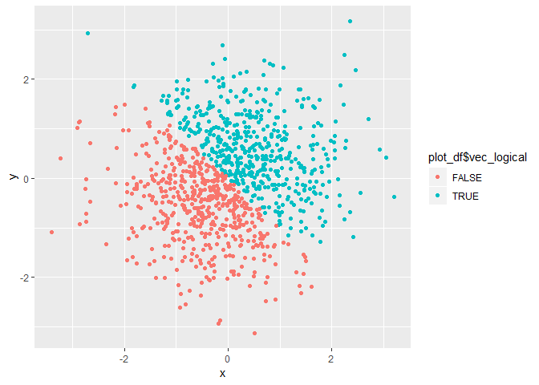
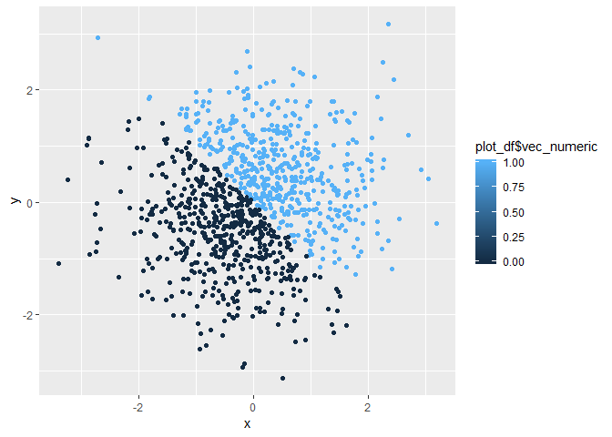
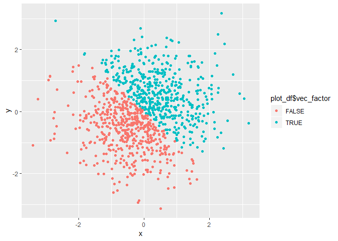

p8105\_hw1\_yw3095
================
Yixuan Wang
9/21/2018

problem 1:
----------

This problem focuses on plotting and the use of inline R code.

First, we create a dataframe:

``` r
set.seed(1234)
hw1_df = tibble(
  norm_samp = runif(10, min = 0, max = 5),
  vec_logical = c(FALSE,TRUE,TRUE,TRUE,TRUE,TRUE,FALSE,FALSE,TRUE,TRUE),
  vec_char = c("good","bad", "good","good","good","bad","good","good","good","bad"),
  vec_factor = factor(c("one","two","three","four","five","six","seven","eight","nine","ten"))
)
```

examine classes

``` r
class(hw1_df$vec_char)
```

    ## [1] "character"

``` r
class(hw1_df$vec_factor)
```

    ## [1] "factor"

Try to take the mean of each variable in your dataframe.

``` r
mean(hw1_df$norm_samp)
```

    ## [1] 2.446132

``` r
mean(hw1_df$vec_logical)
```

    ## [1] 0.7

``` r
mean(hw1_df$vec_char)
```

    ## Warning in mean.default(hw1_df$vec_char): argument is not numeric or
    ## logical: returning NA

    ## [1] NA

``` r
mean(hw1_df$vec_factor)
```

    ## Warning in mean.default(hw1_df$vec_factor): argument is not numeric or
    ## logical: returning NA

    ## [1] NA

-   What works and what doesn’t? Why?
    -   answer:The random sample and the logical vector work but the charcter vector and factor vector don't work as their classes are not numeric or logical.

Write a code chunk that applies the as.numeric function to the logical, character, and factor variables

``` r
as.numeric(hw1_df$vec_logical)
as.numeric(hw1_df$vec_char)
```

    ## Warning: NAs introduced by coercion

``` r
as.numeric(hw1_df$vec_factor)
```

-   Explain what happened?
    -   answer:

Convert your character variable from character to factor to numeric; similarly, convert your factor variable from factor to character to numeric.

problem 2:
----------

This problem focuses on plotting and the use of inline R code.

First, we create a dataframe:

``` r
  x = rnorm(1000)
  y = rnorm(1000)
  vec_logical = x + y > 0
  
plot_df = tibble(
  x,
  y,
  vec_logical,
  vec_numeric = as.numeric(vec_logical),
  vec_factor = as.factor(vec_logical)
)
```

The size of the dataset is 1000. The mean of the x is -0.0259401, and the median of the x is -0.0397942. The proportion of cases for which the logical vector is true is 49.8%.

1.  Make a scatterplot of y vs x (color using the logical variable):

``` r
ggplot(plot_df, aes(x = x, y = y, color = plot_df$vec_logical)) + geom_point()
```

 2. Make a scatterplot of y vs x (color using the numeric variable):

``` r
ggplot(plot_df, aes(x = x, y = y, color = plot_df$vec_numeric)) + geom_point()
```

 3. Make a scatterplot of y vs x (color using the factor variable):

``` r
ggplot(plot_df, aes(x = x, y = y, color = plot_df$vec_factor)) + geom_point()
```



-   Export the first scatterplot to my project directory

``` r
ggplot(plot_df, aes(x = x, y = y, color = plot_df$vec_logical)) + geom_point()
```

``` r
ggsave("scatter_plot.pdf", height = 4, width = 6)
```
